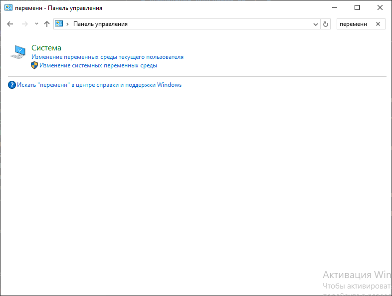
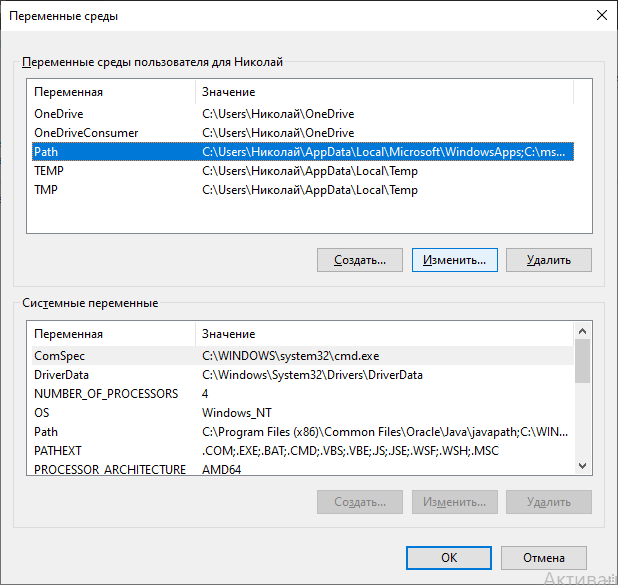
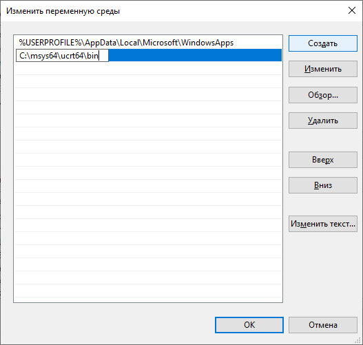
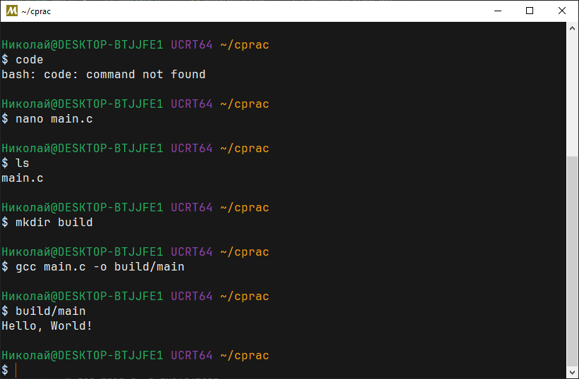
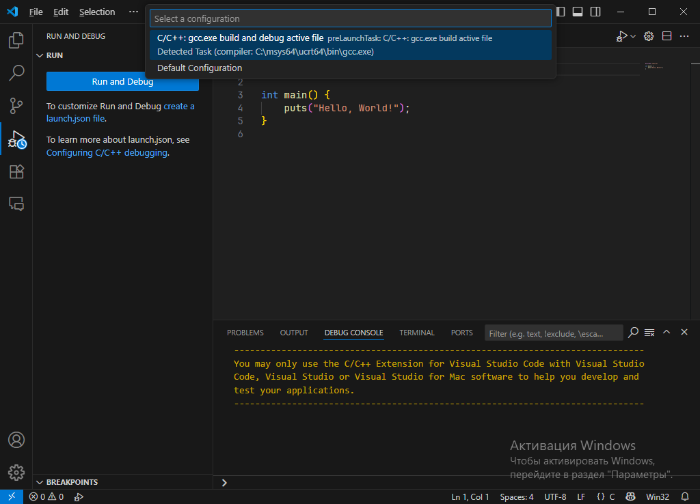
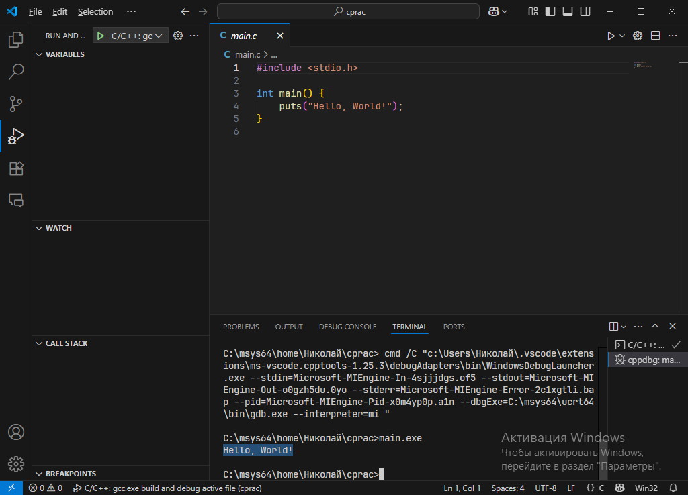

# Компиляция программы на `C` #

## Запуск компилятора, флаги ##

В общем виде:

    cc main.c

Команда компилирует программу, которая целиком состоит из файла `main.c`.

Исполняемый файл получит название `a.exe` на MS Windows и
`a.out` на других платформах.

Это можно изменить, используя флаг `-o`:

    cc.exe -o hello.exe main.c

Флаг `-std` указывает стандарт языка:

    cc -std=c23 main.c

Флаг `-O` указывает уровень оптимизации:

    gcc -O2 hello.c -o hello

- `-O0`: без оптимизации (по умолчанию)
- `-O` = `-O1`: с оптимизацией
- `-O2`: максимальная стабильная оптимизация. Используется чаще всего
- `-O3`: еще больше оптимизации. Может привести к багам и расходам памяти
- `-Ofast`: еще больше оптимизации! Не рекомендуется.
- `-Os`: оптимизация размера исполняемого файла. Основывается на `-O2`

Чем выше уровень оптимизации (выше цифра), тем больше времени занимает
компиляция.

Флаг `-g` отвечает за генерацию отладочной информации.

## Установка компилятора ##

`cc` - общее название компилятора языка `C`.

Это имя использует большинство реализаций компилятора языка.
Чтобы избежать путаницы, вместо `cc` можно указать имя
конкретной реализации, например `gcc`, `clang`.

Следует учитывать, что путь к компилятору может отсутствовать в переменной
`PATH`.
На платформе MS Windows обычно так и есть.
Если это так, его нельзя будет запустить без указания пути.

В семействе ОС GNU/Linux компилятор можно установить при помощи
менеджера пакетов. В MS Windows для использования
компилятора GCC от проекта GNU нужно установить Unix-подобную среду MSYS2.

Внутри неё, можно использовать пакетный менеджер из Arch Linux
под названием `pacman`.

    $ pacman -S mingw-w64-ucrt-x86_64-gcc

После установки компилятор будет доступен без явного указания пути
__внутри среды__. Для доступа вне среды, особенно для VS Code, рекомендуется
добавить путь к нему в переменную `PATH`.

Параметры переменных среды можно найти в панели управления:

Изменять переменные среды следует для пользователя, а не для всей системы.

Найти переменную `Path` и нажать __Изменить__:

По умолчанию компилятор будет установлен в `C:\msys64\ucrt64\bin`.

Для использования компилятора совершенно необязательно использовать IDE.
Можно использовать VS Code как редактор исходного кода, и компилировать
программы из терминала (командной строки), желательно внутри 
варианта среды MSYS (например, UCRT).

Например, можно открыть его в папке с исходным файлом (`*.c`) и ввести:

    $ mkdir build
    $ gcc main.c -o build/main
    $ build/main

Если переменная `PATH` правильно настроена,
компилировать файлы можно без команд в VS Code с расширением для C/C++.

